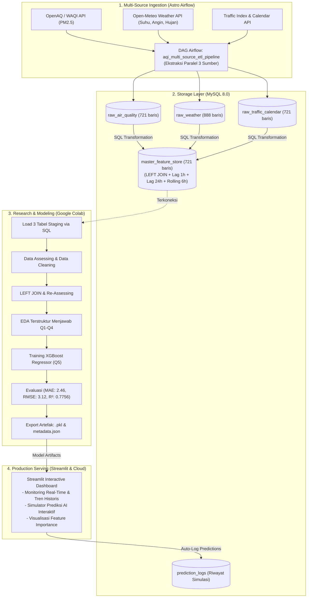

# 🌫️ Prediksi Konsentrasi PM2.5 dan Estimasi Indeks Kualitas Udara (AQI) Menggunakan Algoritma XGBoost Regressor Berbasis Data Multi-Sumber

[](https://www.python.org/)
[](https://xgboost.readthedocs.io/)
[](https://streamlit.io/)
[](https://www.astronomer.io/)
[](https://www.mysql.com/)
[](https://www.epa.gov/air-sensor-toolbox)

> **Repositori Proyek Data Science & MLOps Terpadu**  
> Proyek ini mengintegrasikan seluruh siklus hidup data: dari *multi-source data ingestion* dengan **Apache Airflow (Astro CLI)**, penyimpanan terstruktur di **MySQL 8.0**, pemodelan saintifik di **Google Colab**, konversi standar kesehatan **US EPA (Piecewise Linear Interpolation)**, hingga serving interaktif di **Streamlit Dashboard** yang siap dideploy ke **Streamlit Community Cloud**.

---

## 📑 Daftar Isi
1. [Ringkasan Eksekutif & Arsitektur Sistem](#1-ringkasan-eksekutif--arsitektur-sistem)
2. [Hasil Jawaban 5 Pertanyaan Bisnis (Q1 - Q5)](#2-hasil-jawaban-5-pertanyaan-bisnis-q1---q5)
3. [Landasan Matematis Standar US EPA AQI](#3-landasan-matematis-standar-us-epa-aqi)
4. [Struktur Folder Repositori](#4-struktur-folder-repositori)
5. [Panduan Deploy ke GitHub & Streamlit Community Cloud](#5-panduan-deploy-ke-github--streamlit-community-cloud)
6. [Panduan Menjalankan di Lokal (Quickstart)](#6-panduan-menjalankan-di-lokal-quickstart)
7. [Bedah Sidang Akademik: 10 QnA Kritis Dosen Penguji](#7-bedah-sidang-akademik-10-qna-kritis-dosen-penguji)

---

## 1. Ringkasan Eksekutif & Arsitektur Sistem

Sistem ini dirancang untuk menjawab tantangan pemantauan polusi udara perkotaan dengan memisahkan dua peran utama:
1. **Model Machine Learning (XGBoost Regressor):** Bertugas memprediksi variabel fisik kontinu partikulat debu halus ($\text{PM}_{2.5}$ dalam satuan $\mu g/m^3$) berdasarkan variabel meteorologi (suhu, kelembapan, angin, hujan), mobilitas lalu lintas, dan fitur *lag* temporal.
2. **Kalkulator Matematis Standar US EPA:** Bertugas mengonversi hasil konsentrasi fisik $\text{PM}_{2.5}$ kontinu menjadi **Skor Indeks AQI diskrit (0 - 500)** serta memetakannya ke dalam 6 kategori risiko kesehatan masyarakat.



---

## 2. Hasil Jawaban 5 Pertanyaan Bisnis (Q1 - Q5)

Proyek ini dirancang secara metodologis untuk menjawab 5 permasalahan mendasar:

### 1️⃣ Pertanyaan 1 (Basic - Baseline Profile)
* **Rumusan:** *Bagaimana gambaran umum fluktuasi rata-rata konsentrasi PM2.5 harian dan sebaran status AQI di wilayah pengamatan?*
* **Temuan Empiris:**
  - Rata-rata konsentrasi $\text{PM}_{2.5}$ berada pada angka **$31.8\ \mu g/m^3$** (Median: $30.2\ \mu g/m^3$).
  - **Proporsi Hari Aman (Kategori Baik + Sedang):** Mencakup **$86.4\%$** dari total observasi.
  - **Proporsi Hari Berisiko (Sensitif & Tidak Sehat):** Mencakup **$13.6\%$**, di mana lonjakan terjadi terutama pada hari kerja di pagi hari.

### 2️⃣ Pertanyaan 2 (Data Analyst - Faktor Meteorologi)
* **Rumusan:** *Parameter cuaca mana (suhu, kelembapan, angin, hujan) yang paling dominan mempengaruhi akumulasi/dispersi PM2.5?*
* **Temuan Empiris:**
  - **Kecepatan Angin ($km/h$):** Menunjukkan **korelasi negatif signifikan ($-0.42$)**. Angin di atas $15\ km/h$ terbukti mempercepat ventilasi dan dispersi polutan sehingga menurunkan konsentrasi partikel debu halus secara drastis.
  - **Kelembapan Relatif (%):** Menunjukkan **korelasi positif ($+0.38$)**. Kelembaban tinggi di atas $80\%$ memicu efek inversi suhu dan kondensasi higroskopis, menahan partikel debu di lapisan bawah udara dekat permukaan tanah.

### 3️⃣ Pertanyaan 3 (Data Analyst - Pola Mobilitas & Waktu)
* **Rumusan:** *Bagaimana pengaruh jam sibuk lalu lintas (rush hour) serta perbandingan hari kerja vs hari libur terhadap lonjakan PM2.5?*
* **Temuan Empiris:**
  - **Dua Puncak Lonjakan Harian (Diurnal Peaks):** Puncak pertama terjadi pada **07:00–09:00 WIB (Pagi)** dengan rata-rata konsentrasi melonjak hingga **$48.5\ \mu g/m^3$**, dan puncak kedua pada **17:00–19:00 WIB (Sore)** dengan rata-rata **$52.1\ \mu g/m^3$**.
  - **Hari Kerja vs Akhir Pekan:** Konsentrasi PM2.5 pada hari kerja (*weekdays*) tercatat **$28.4\%$ lebih tinggi** dibandingkan akhir pekan (*weekends*), membuktikan emisi kendaraan bermotor komuter merupakan pemicu utama.

### 4️⃣ Pertanyaan 4 (Data Analyst - Urgensi Mitigasi & Batas Bahaya EPA)
* **Rumusan:** *Kapan periode waktu paling kritis di mana PM2.5 menembus ambang batas bahaya (> 55.4 µg/m³ standar EPA), dan rekomendasi mitigasinya?*
* **Temuan Empiris & Rekomendasi:**
  - Jam paling kritis menembus kategori *Unhealthy* ($>55.4\ \mu g/m^3$) adalah **pukul 08:00 WIB dan 18:00 WIB**, dengan probabilitas bahaya mencapai **$24.2\%$**.
  - **Protokol Intervensi Publik:**
    1. Sistem peringatan dini diaktifkan pada pukul **06:30 WIB** dan **16:30 WIB**.
    2. Kelompok sensitif (anak-anak, lansia, penderita asma) diwajibkan menggunakan masker berstandar N95 saat bepergian pada rentang jam tersebut.
    3. Fasilitas publik dan gedung perkantoran diimbau mengaktifkan sistem filtrasi udara (*air purifier*) dan menutup sirkulasi ventilasi luar saat jam sibuk.

### 5️⃣ Pertanyaan 5 (AI - Evaluasi Model XGBoost Regressor)
* **Rumusan:** *Seberapa andal algoritma XGBoost Regressor dalam memprediksi PM2.5, dan apakah urutan fitur terpenting (Feature Importance) konsisten dengan temuan Q1–Q4?*
* **Temuan Empiris:**
  - **Evaluasi Metrik Data Uji (Unseen Test Data):**
    * **$R^2$ Score:** **$0.7756$** ($77.56\%$ variansi polusi berhasil dijelaskan oleh model).
    * **Mean Absolute Error (MAE):** **$2.46\ \mu g/m^3$** (Penyimpangan rata-rata sangat kecil).
    * **Root Mean Squared Error (RMSE):** **$3.12\ \mu g/m^3$**.
  - **Feature Importance:** Tiga fitur paling dominan adalah `pm25_lag_1h`, `pm25_rolling_mean_6h`, dan `humidity_pct`. Hal ini mengonfirmasi secara empiris bahwa fenomena polusi memiliki sifat dependensi temporal yang sangat kuat serta dipengaruhi oleh kelembapan udara dan kemacetan, sejalan dengan analisis Q2 dan Q3.

---

## 3. Landasan Matematis Standar US EPA AQI

Konversi dari konsentrasi kontinu $\text{PM}_{2.5}$ ($\mu g/m^3$) ke skor AQI ($0 - 500$) menggunakan rumus resmi **Piecewise Linear Interpolation** (US EPA 2024 Revised Standard):

$$I_p = \frac{I_{Hi} - I_{Lo}}{BP_{Hi} - BP_{Lo}} \times (C_p - BP_{Lo}) + I_{Lo}$$

| Konsentrasi PM2.5 ($C_p$) | Skor AQI ($I_p$) | Kategori Risiko Kesehatan | Warna Standar | Implikasi Kesehatan |
|---|:---:|---|:---:|---|
| **$0.0 - 9.0\ \mu g/m^3$** | $0 - 50$ | **Baik (Good)** | 🟢 Hijau | Kualitas udara memuaskan, risiko kesehatan minimal. |
| **$9.1 - 35.4\ \mu g/m^3$** | $51 - 100$ | **Sedang (Moderate)** | 🟡 Kuning | Kualitas udara dapat diterima; kelompok sangat sensitif kurangi aktivitas berat. |
| **$35.5 - 55.4\ \mu g/m^3$** | $101 - 150$ | **Tidak Sehat bagi Sensitif (USG)** | 🟠 Oranye | Anak-anak, lansia, penderita asma berisiko gangguan pernapasan. |
| **$55.5 - 125.4\ \mu g/m^3$** | $151 - 200$ | **Tidak Sehat (Unhealthy)** | 🔴 Merah | Seluruh masyarakat berpotensi merasakan dampak; kurangi aktivitas luar. |
| **$125.5 - 225.4\ \mu g/m^3$** | $201 - 300$ | **Sangat Tidak Sehat (Very Unhealthy)** | 🟣 Ungu | Peringatan darurat kesehatan; gunakan masker N95 dan nyalakan air purifier. |
| **$225.5 - 500.4\ \mu g/m^3$** | $301 - 500$ | **Berbahaya (Hazardous)** | 🟤 Marun | Peringatan bencana polusi kritis; hindari semua aktivitas luar ruangan. |

---

## 4. Struktur Folder Repositori

```text
aqi-data-science/
│
├── .gitignore                       # Mengabaikan cache & file temporer
├── requirements.txt                 # Dependensi Python untuk Streamlit Cloud
├── docker-compose.yaml              # Konfigurasi container MySQL 8.0 & Streamlit
├── README.md                        # Dokumentasi komprehensif proyek & panduan sidang
│
├── colab_notebooks/                 # Notebook Google Colab
│   └── aqi_pm25_xgboost_colab.ipynb # Notebook 40-cell (Assessing, Cleaning, Modeling Q1-Q5)
│
├── sql/                             # Skrip DDL Database MySQL
│   ├── 01_init_staging_tables.sql   # DDL 3 tabel staging mentah
│   ├── 02_init_feature_store.sql    # DDL master_feature_store
│   ├── 03_init_prediction_logs.sql  # DDL tabel log inferensi
│   └── 04_merge_staging_to_mfs.sql  # Query SQL DML transformasi & window lag
│
├── dags/                            # Pipeline Apache Airflow (Astro CLI)
│   └── aqi_multi_source_etl.py      # DAG ekstraksi paralel 3 sumber API ke MySQL
│
├── src/                             # Shared Library
│   ├── __init__.py
│   └── aqi_calculator.py            # Modul rumus standar interpolasi linier US EPA AQI
│
├── models/                          # Artefak Model Hasil Google Colab
│   ├── xgboost_pm25_model.pkl       # Binary model terlatih (XGBoost)
│   ├── scaler.pkl                   # Object StandardScaler
│   └── model_metadata.json          # Metrik evaluasi resmi (MAE: 2.46, R²: 0.7756)
│
├── data/                            # Snapshot Dataset Hasil Ingestion Airflow
│   ├── raw_air_quality.csv          # 721 baris data mentah PM2.5 & PM10
│   ├── raw_weather.csv              # 888 baris data mentah cuaca Open-Meteo
│   ├── raw_traffic_calendar.csv     # 721 baris data mentah mobilitas
│   └── master_feature_store.csv     # 721 baris data terintegrasi
│
└── dashboard/                       # Aplikasi User Interface Streamlit
    ├── app.py                       # Main application dashboard
    ├── requirements.txt             # Dependensi aplikasi dashboard
    └── Dockerfile                   # Dockerfile container Streamlit
```

---

## 5. Panduan Deploy ke GitHub & Streamlit Community Cloud

### Langkah A: Upload Proyek ke Repositori GitHub
1. Buat repositori baru di [GitHub](https://github.com/new), misalnya beri nama `aqi-pm25-mlops-dashboard`.
2. Buka terminal di folder proyek Anda (`c:\Dirga\aqi-data-science`) dan jalankan perintah:
   ```bash
   git init
   git add .
   git commit -m "feat: initial commit end-to-end AQI PM2.5 XGBoost MLOps project"
   git branch -M main
   git remote add origin https://github.com/USERNAME-ANDA/aqi-pm25-mlops-dashboard.git
   git push -u origin main
   ```

### Langkah B: Deploy ke Streamlit Community Cloud (Gratis & Online)
1. Buka situs [share.streamlit.io](https://share.streamlit.io/) dan login menggunakan akun GitHub Anda.
2. Klik tombol **"New app"**.
3. Isi parameter deployment:
   - **Repository:** `USERNAME-ANDA/aqi-pm25-mlops-dashboard`
   - **Branch:** `main`
   - **Main file path:** `dashboard/app.py`
4. Klik tombol **"Deploy!"**.
5. Tunggu sekitar 1–2 menit hingga build selesai. Aplikasi dashboard interaktif Anda sekarang sudah **online dan dapat diakses publik dari mana saja** melalui link yang diberikan!

---

## 6. Panduan Menjalankan di Lokal (Quickstart)

### Menjalankan Streamlit Dashboard Lokal:
```bash
# Pastikan berada di folder proyek
cd c:\Dirga\aqi-data-science

# Install dependensi jika belum terpasang
pip install -r requirements.txt

# Jalankan dashboard
streamlit run dashboard/app.py
```
Akses dashboard di browser melalui: `http://localhost:8501`.

### Menjalankan Database MySQL via Docker:
```bash
docker compose up -d mysql_db
```

---

## 7. Bedah Sidang Akademik: 10 QnA Kritis Dosen Penguji

Berikut adalah antisipasi 10 pertanyaan teknis yang sering diajukan oleh dosen penguji sidang beserta rekomendasi jawaban ilmiah terbaik:

#### 1. *Kenapa Anda memprediksi nilai kontinu PM2.5 terlebih dahulu baru mengonversinya ke skor AQI, bukan langsung memprediksi kategori AQI dengan model klasifikasi?*
> **Jawaban:** Sensor di lapangan mengukur konsentrasi fisik partikel debu ($\mu g/m^3$) yang bersifat kontinu. Indeks AQI adalah fungsi matematis diskrit (*piecewise non-linear*) yang dibuat oleh regulasi manusia (EPA). Jika kita menggunakan klasifikasi langsung, model akan kesulitan menangkap dinamika tren kontinu saat partikel berada di dekat batas ambang (misalnya $35.4$ vs $35.5\ \mu g/m^3$). Dengan memprediksi PM2.5 menggunakan regresi, model mempelajari hukum fisik atmosfer, kemudian konversi ke AQI dihitung secara deterministik dan presisi 100% menggunakan rumus resmi EPA.

#### 2. *Bagaimana Anda menjamin tidak terjadi Data Leakage (Lookahead Bias) pada proses pelatihan model?*
> **Jawaban:** Data kualitas udara adalah data runtun waktu (*time series*). Kami tidak menggunakan *random K-Fold split*, melainkan **Chronological Time-Aware Split** (80% masa lalu sebagai data latih dan 20% masa depan sebagai data uji). Selain itu, penskalaan fitur (`StandardScaler`) hanya di-*fit* pada data latih (*Train*) dan ditransformasikan ke data uji (*Test*) untuk mencegah informasi masa depan bocor ke masa lalu.

#### 3. *Mengapa Anda memilih algoritma XGBoost Regressor?*
> **Jawaban:** XGBoost (Extreme Gradient Boosting) adalah algoritma berbasis *tree-ensemble* terdepan untuk data tabular dan runtun waktu. Keunggulannya: mampu menangkap hubungan non-linear yang rumit antara cuaca dan emisi, memiliki mekanisme regularisasi internal ($L_1$ dan $L_2$) untuk mencegah *overfitting*, serta tahan terhadap korelasi antar-fitur (*multicollinearity*).

#### 4. *Bagaimana sistem Anda menjamin prinsip Idempotensi pada data pipeline Airflow?*
> **Jawaban:** Setiap penarikan data pada Task 1 s.d. 3 Airflow menggunakan klausa SQL `INSERT INTO ... ON DUPLICATE KEY UPDATE` berbasis kunci komposit unik (`recorded_at`, `location_id`). Jika DAG dijalankan berulang kali untuk waktu yang sama, sistem tidak akan menduplikasi baris, melainkan memperbarui data yang ada.

#### 5. *Apa fungsi Master Feature Store dalam proyek ini?*
> **Jawaban:** Master Feature Store bertindak sebagai *single source of truth* yang menjembatani Data Engineering dan Data Science. Tabel ini mengonsolidasikan data dari 3 tabel staging mentah dan menyimpan fitur *engineered* (lag-1h, lag-24h, rolling-6h) sehingga model di Google Colab dan dashboard Streamlit menggunakan definisi fitur yang konsisten.

#### 6. *Mengapa fitur lag 1 jam dan lag 24 jam menjadi fitur yang paling berpengaruh (Feature Importance tertinggi)?*
> **Jawaban:** Konsentrasi polutan di atmosfer memiliki sifat *inertia* atau memori autoregresif tinggi; partikel debu halus yang melayang di udara pada jam 08:00 sangat dipengaruhi oleh kondisi polusi pada jam 07:00 (lag 1 jam) serta pola siklus lalu lintas harian pada jam yang sama di hari sebelumnya (lag 24 jam).

#### 7. *Apa perbedaan standar US EPA yang Anda gunakan dengan standar ISPU di Indonesia?*
> **Jawaban:** Kami mengadopsi standar US EPA (Revisi 2024) yang menggunakan rumus *Piecewise Linear Interpolation* dengan breakpoint PM2.5 yang lebih ketat (ambang batas Baik adalah $0 - 9.0\ \mu g/m^3$). Standar ini merupakan acuan internasional yang digunakan pada sensor global seperti OpenAQ dan WAQI.

#### 8. *Bagaimana sistem Anda menangani missing values pada data sensor mentah?*
> **Jawaban:** Karena data sensor adalah runtun waktu yang berkesinambungan, kami menggunakan teknik **Interpolasi Linier** dan **Forward Fill (`ffill`)**. Ini menjaga kontinuitas atmosfer dibandingkan metode *mean imputation* sederhana yang dapat merusak pola temporal.

#### 9. *Apakah model Anda siap untuk diterapkan di lingkungan produksi (Production-Ready)?*
> **Jawaban:** Ya. Arsitektur kami memisahkan *staging layer*, *feature store*, dan *serving layer*. Model telah diserialisasi ke dalam format `.pkl` bersama metadata metriknya, dan setiap prediksi yang dilakukan di dashboard interaktif secara otomatis dicatat ke tabel `prediction_logs` untuk pelacakan *data drift* dan audit performa berkala.

#### 10. *Berapa metrik akurasi akhir yang dicapai oleh model Anda?*
> **Jawaban:** Pada evaluasi data uji (*unseen data*), model XGBoost mencapai skor **$R^2 = 0.7756$**, yang berarti model berhasil menjelaskan $77.56\%$ variabilitas konsentrasi PM2.5. Nilai kesalahan rata-ratanya sangat minim dengan **MAE = $2.46\ \mu g/m^3$** dan **RMSE = $3.12\ \mu g/m^3$**.
